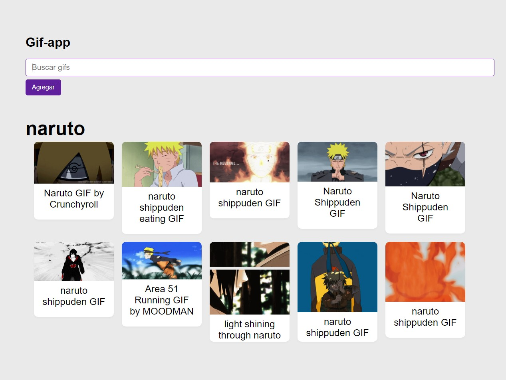

# Aplicación de  busquedas de Gif

- Se utilizaron conceptos básicos de `React`
- Se Realizaron `Test` a todos los componentes y archivos js
- Al final se incluye configuración básica para `Testear` la aplicación

## Vista Previa



## Instalación y configuración de Jest + React Testing Library

### En proyectos de React + Vite

1. Instalaciones:

```terminal
yarn add --dev jest babel-jest @babel/preset-env @babel/preset-react 
yarn add --dev @testing-library/react @types/jest jest-environment-jsdom
```

1.1 Opcional: Si usamos Fetch API en el proyecto:

```terminal
yarn add --dev whatwg-fetch
```

1.2 Actualizar los scripts del __package.json__

```script
"scripts: {
  ...
  "test": "jest --watchAll"
```

1.3 Crear la configuración de babel __babel.config.js__

```config
module.exports = {
    presets: [
        [ '@babel/preset-env', { targets: { esmodules: true } } ],
        [ '@babel/preset-react', { runtime: 'automatic' } ],
    ],
};
```

1.4 Opcional, pero eventualmente necesario, crear Jest config y setup:

`__jest.config.js__`

``` config
module.exports = {
    testEnvironment: 'jest-environment-jsdom',
    setupFiles: ['./jest.setup.js']
}
```

`__jest.setup.js__`

1.5 implementación del FetchAPI

- !IMPORTANTE! instala isomorphic-fetch y has la importación en jest.setup.js

``` Nota
import 'isomorphic-fetch'; // <-- yarn add isomorphic-fetch
import 'whatwg-fetch'; // <-- yarn add whatwg-fetch

```
